

<div class="MCWHeader1">
Hybrid identity
</div>

<div class="MCWHeader2">
Hands-on lab step-by-step
</div>

<div class="MCWHeader3">
June 2020
</div>


Information in this document, including URL and other Internet Web site references, is subject to change without notice. Unless otherwise noted, the example companies, organizations, products, domain names, e-mail addresses, logos, people, places, and events depicted herein are fictitious, and no association with any real company, organization, product, domain name, e-mail address, logo, person, place or event is intended or should be inferred. Complying with all applicable copyright laws is the responsibility of the user. Without limiting the rights under copyright, no part of this document may be reproduced, stored in or introduced into a retrieval system, or transmitted in any form or by any means (electronic, mechanical, photocopying, recording, or otherwise), or for any purpose, without the express written permission of Microsoft Corporation.

Microsoft may have patents, patent applications, trademarks, copyrights, or other intellectual property rights covering subject matter in this document. Except as expressly provided in any written license agreement from Microsoft, the furnishing of this document does not give you any license to these patents, trademarks, copyrights, or other intellectual property.

The names of manufacturers, products, or URLs are provided for informational purposes only and Microsoft makes no representations and warranties, either expressed, implied, or statutory, regarding these manufacturers or the use of the products with any Microsoft technologies. The inclusion of a manufacturer or product does not imply endorsement of Microsoft of the manufacturer or product. Links may be provided to third party sites. Such sites are not under the control of Microsoft and Microsoft is not responsible for the contents of any linked site or any link contained in a linked site, or any changes or updates to such sites. Microsoft is not responsible for webcasting or any other form of transmission received from any linked site. Microsoft is providing these links to you only as a convenience, and the inclusion of any link does not imply endorsement of Microsoft of the site or the products contained therein.

2020 Microsoft Corporation. All rights reserved.

Microsoft and the trademarks listed at <https://www.microsoft.com/en-us/legal/intellectualproperty/Trademarks/Usage/General.aspx> are trademarks of the Microsoft group of companies. All other trademarks are property of their respective owners.

**Contents**

<!-- TOC -->

- [Hybrid identity hands-on lab step-by-step](#hybrid-identity-hands-on-lab-step-by-step)
  - [Abstract and learning objectives](#abstract-and-learning-objectives)
  - [Overview](#overview)
  - [Solution architecture](#solution-architecture)
  - [Exercise 1: Integrate an Active Directory forest with an Azure Active Directory tenant](#exercise-1-integrate-an-active-directory-forest-with-an-azure-active-directory-tenant)
    - [Overview](#overview-1)
    - [Task 1: Create an Azure Active Directory tenant and activate an EMS E5 trial](#task-1-create-an-azure-active-directory-tenant-and-activate-an-ems-e5-trial)
    - [Task 2: Create and configure Azure AD users](#task-2-create-and-configure-azure-ad-users)
    - [Task 3: Purchase a custom domain name](#task-3-purchase-a-custom-domain-name)
    - [Task 4: Assign a custom domain name to the Contoso Azure AD tenant](#task-4-assign-a-custom-domain-name-to-the-contoso-azure-ad-tenant)
    - [Task 5: Configure DNS suffix in the Contoso Active Directory forest](#task-5-configure-dns-suffix-in-the-contoso-active-directory-forest)
    - [Task 6: Install Azure AD Connect](#task-6-install-azure-ad-connect)
    - [Task 7: Enable Active Directory Recycle Bin](#task-7-enable-active-directory-recycle-bin)
    - [Task 8: Configure Azure AD Connect attribute-level filtering](#task-8-configure-azure-ad-connect-attribute-level-filtering)
    - [Task 9: Initiate and verify directory synchronization](#task-9-initiate-and-verify-directory-synchronization)
    - [Task 10: Configure Hybrid Azure AD join](#task-10-configure-hybrid-azure-ad-join)
    - [Task 11: Perform Hybrid Azure AD join](#task-11-perform-hybrid-azure-ad-join)
    - [Summary](#summary)
  - [Exercise 2: Manage Authentication, Authorization, and Access Control in Hybrid Scenarios](#exercise-2-manage-authentication-authorization-and-access-control-in-hybrid-scenarios)
    - [Overview](#overview-2)
    - [Task 1: Create Active Directory groups](#task-1-create-active-directory-groups)
    - [Task 2: Assign EMS E5 licenses to Azure AD users](#task-2-assign-ems-e5-licenses-to-azure-ad-users)
    - [Task 3: Enable Azure AD Multi-Factor Authentication](#task-3-enable-azure-ad-multi-factor-authentication)
    - [Task 4: Enable password writeback and Self-Service Password Reset](#task-4-enable-password-writeback-and-self-service-password-reset)
    - [Task 5: Implement Azure AD Password Protection for Windows Server Active Directory](#task-5-implement-azure-ad-password-protection-for-windows-server-active-directory)
    - [Task 6: Enable Azure Active Directory Identity Protection](#task-6-enable-azure-active-directory-identity-protection)
    - [Task 7: Enable Automatic Intune Enrollment](#task-7-enable-automatic-intune-enrollment)
    - [Task 8: Enable Enterprise-State-Roaming](#task-8-enable-enterprise-state-roaming)
    - [Task 9: Implement Azure AD Conditional Access Policies](#task-9-implement-azure-ad-conditional-access-policies)
    - [Task 10: Implement Azure AD Privileged Identity Management](#task-10-implement-azure-ad-privileged-identity-management)
    - [Summary](#summary-1)
  - [Exercise 3: Configure application access in hybrid scenarios](#exercise-3-configure-application-access-in-hybrid-scenarios)
    - [Overview](#overview-3)
    - [Task 1: Install and configure Azure AD Application Proxy](#task-1-install-and-configure-azure-ad-application-proxy)
    - [Task 2: Configure an Azure AD Application Proxy application](#task-2-configure-an-azure-ad-application-proxy-application)
    - [Task 3: Test an Azure AD Application Proxy application](#task-3-test-an-azure-ad-application-proxy-application)
    - [Task 4: Create an Azure Active Directory tenant and activate an EMS E5 trial](#task-4-create-an-azure-active-directory-tenant-and-activate-an-ems-e5-trial)
    - [Task 5: Create and configure Azure AD users](#task-5-create-and-configure-azure-ad-users)
    - [Task 6: Create and configure Azure AD guest user and group accounts](#task-6-create-and-configure-azure-ad-guest-user-and-group-accounts)
    - [Task 7: Configure an Azure AD Application Proxy application for B2B access](#task-7-configure-an-azure-ad-application-proxy-application-for-b2b-access)
    - [Task 8: Test an Azure AD Application Proxy application](#task-8-test-an-azure-ad-application-proxy-application)
    - [Summary](#summary-2)
  - [Lab summary](#lab-summary)
  - [After the hands-on lab](#after-the-hands-on-lab)
    - [Task 1: Delete resources](#task-1-delete-resources)

<!-- /TOC -->

# Hybrid identity hands-on lab step-by-step 

## Abstract and learning objectives 

In this hands-on lab you will setup and configure a number of different hybrid identity scenarios. The scenarios involve an Active Directory single-domain forest named contoso.local, which in this lab environment, consists (for simplicity reasons) of a single domain controller named DC1 and a single domain member server named APP1. The intention is to explore Azure AD-related capabilities that allow you to integrate Active Directory with Azure Active Directory, optimize hybrid authentication and authorization, and provide secure access to on-premises resources from Internet for both organizational users and users who are members of partner organizations. 

## Overview

Contoso has asked you to integrate their on-premises Active Directory single-domain forest named contoso.local with Azure AD and implement all necessary prerequisites to allow them to benefit from such Azure AD features as single sign-on to cloud and on-premises applications, enhanced sign-in security with Multi-Factor Authentication and Windows Hello for Business, Hybrid Azure AD join, Self-Service Password Reset and Password Protection, automatic enrollment of Windows 10 devices into Microsoft Intune, and Azure AD Privileged Identity Protection. They want to also provide secure access to their on-premises, Windows Integrated Authentication-based applications from Internet for both organizational users and users who are members of partner organizations, although they also want to be able to loosen restrictions when access originates from Hybrid Azure AD joined computers residing in their on-premises data centers. The same applications need to also be made available to Contoso's business partners. 

## Solution architecture

From the architectural standpoint, the deployment will consist of the following components:

-   "On-premises" Active Directory environment consisting of a single domain controller (DC1) and one domain member server (APP1), running Windows Server 2016 operating system. 

-   Contoso Azure AD tenant

-   Fabrikam Azure AD tenant

    ![High level architecture consisting of the on-premises environment represented by a rectangle on the left-hand side, two cloud outlines representing the Azure AD tenant of Contoso and Fabrikam on the right-hand side, and the Microsoft Intune icon in the middle. The on-premises environment contains an icon representing Active Directory domain controllers, providing such functionality as Azure AD Connect-based synchronization with attribute level filtering and password writeback, Azure AD Application Proxy with its on-premises connector, Service Connection Point for Hybrid Azure AD join, and Password Protection DC Agent. There is also a web server icon, representing the hybrid Azure AD joined server hosting the APP1 application, used also as the Password Application Proxy. The Contoso Azure AD tenant provides such functionality as Azure AD application proxy, My Apps portal, Automatic Intune enrollment, Enterprise State Roaming, Conditional Access, Azure AD Identity Protection, Azure AD Privileged Identity Management, Azure AD MFA, and Self-Service Password Reset.](images/Hands-onlabstep-bystep-HybridIdentityImages/media/HOL_Architecture_Overview.png)

## Exercise 1: Integrate an Active Directory forest with an Azure Active Directory tenant

Duration: 150 minutes

### Overview

In this exercise, you will integrate an Active Directory forest with an Azure Active Directory tenant by creating an Azure Active Directory tenant and activating an Enterprise Mobility + Security E5 trial, creating and configuring an Azure AD user, purchasing a custom domain name, assigning a custom domain name to the Contoso Azure AD tenant, configuring DNS suffix in the Contoso Active Directory forest, installing Azure AD Connect, enable Active Directory Recycle Bin, configuring Azure AD Connect attribute-level filtering, initiating and verifying directory synchronization, configuring Hybrid Azure AD join, and performing Hybrid Azure AD join of a Windows Server 2016 VM.

### Task 1: Create an Azure Active Directory tenant and activate an EMS E5 trial

In this task, you will create an Azure Active Directory tenant with the following settings: 

-   Organization name: **Contoso**

-   Initial domain name: any valid, unique domain name.

-   Country or region: **United States**

1. From the lab computer, start a new Web browser window and navigate to the Azure portal at <https://portal.azure.com> if you haven't already.

2. When prompted, sign into the Azure subscription into which you deployed resources in the Before Hands-On Lab exercises.

3. On the lab computer, in the Azure portal, select **+ Create a resource**.

4. On the **New** blade, in the **Search the Marketplace** text box, type **Azure Active Directory** and, in the list of results, select **Azure Active Directory**.

    

5. On the **Azure Active Directory** blade, select **Create**.

6. On the **Create directory** blade, specify the following settings and select **Create**:

    -   Organization name: **Contoso**

    -   Initial domain name: any valid, unique domain name.

    -   Country or region: **United States**

7. Once it's created, navigate to your subscription blade. Select **Change directory**

    

8. In the **Change the directory** blade on the right, select **Contoso** in the dropdown and select **Change**. 

    

9.  In the portal's left navigation, select **Azure Active Directory**. 

10. In the **Azure Active Directory** blade, select **Switch tenant** then select **Contoso**. 

    **Note:** It may take a few minutes for everything to display properly.

    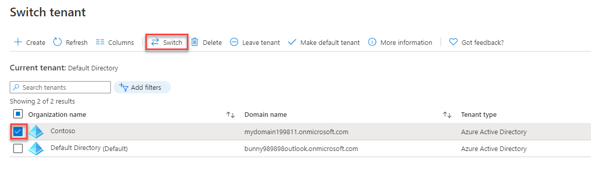

11. On the **Contoso - Overview** blade, select **Licenses** under **Manage** on the left navigation.

12. On the **Contoso - Licenses**, blade, select **All Products** and select **+ Try/Buy**.

13. On the **Activate** blade, in the **ENTERPRISE MOBILITY + SECURITY E5** section, select **Free trial** and then select **Activate**

    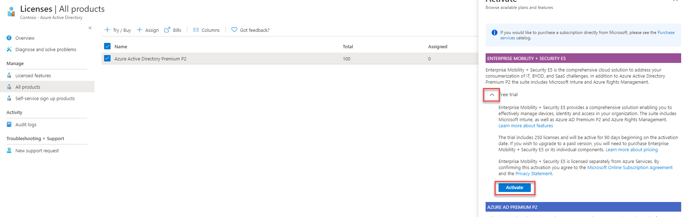

   > **Note**: Activation typically takes about 5 minutes.


### Task 2: Create and configure Azure AD users

In this task, you will configure Azure AD user accounts in the newly created Azure AD tenant with the following settings. This will include assigning EM+S E5 licenses to the user account you are using for this lab as well as creating a new Azure AD user account with the following settings and assigning to it the Global Administrator role as well as the EM+S E5 license.

- Name: **john.doe**

- First name: **John**

- Last name: **Doe**
    
- Password: **Auto-generate password**
    
- Show Password: **Enabled**

- Groups: **0 group selected**
    
- Roles: **Global Administrator**
    
- Block sign in: **No**
    
- Usage location: **United States**
    
- Job title: leave blank
    
- Department: leave blank

1. From the lab computer, in the Azure portal, navigate back to the **Contoso - Overview** blade.

2. On the **Contoso - Overview** blade, select **Users** under **Manage** in the left navigation.

3. On the **Users - All users** blade, select the entry representing your user account.

4. On the **Profile** blade of your user account, in the **Settings** section, select **edit**.

    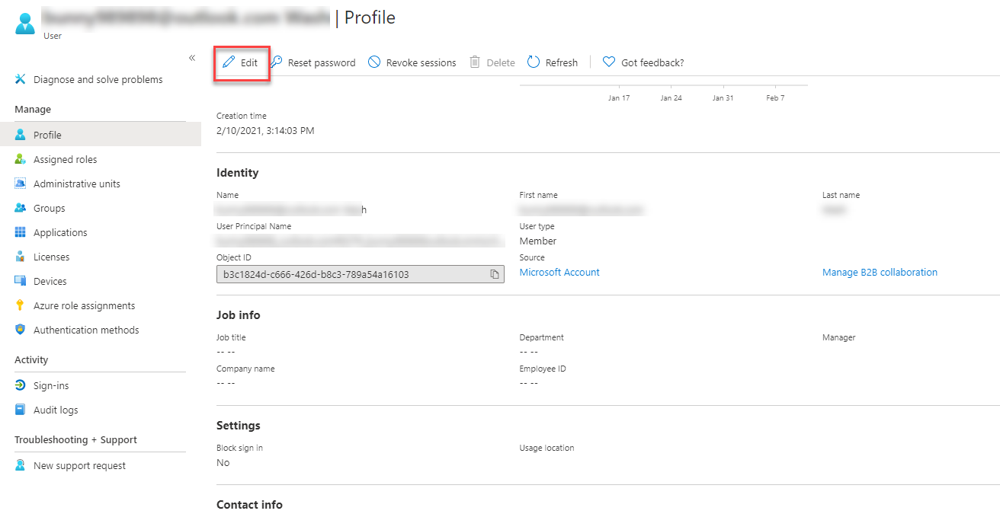

5. In the **Settings** section, in the **Usage location** drop-down list, select the **United States** entry and select **Save**.

    

6. On the **Profile** blade of your user account, select **Licenses** under **Manage** on the left. 

7. On the **Licenses** blade, select **+ Assignments**.

8. On the **Update license assignments** blade, enable the **Enterprise Mobility + Security E5** checkbox, ensure that all the corresponding license options are enabled, and select **Save**.

    

9.  On the **Users - All users** blade, select **+ New user**.

10. On the **New user** blade, ensure that the **Create user** option is selected, specify the following settings, and select **Create**:

    - User name: **john.doe\@*your Azure AD tenant domain name*** where ***your Azure AD tenant domain name*** is the domain name you specified when creating the Contoso Azure AD tenant.

    - Name: **john.doe**

    - First name: **John**

    - Last name: **Doe**
    
    - Password: **Auto-generate password**
    
    - Show Password: **Enabled**

    - Groups: **0 group selected**
    
    - Roles: **Global Administrator**
    
    - Block sign in: **No**
    
    - Usage location: **United States**
    
    - Job title: leave blank
    
    - Department: leave blank

    

    > **Note**: Copy the **User name** and **Password** values into Notepad. You will need them later in this lab.

11. On the **Users - All users** blade, select the entry representing the newly created user account.

12. On the **john.doe - Profile** blade, select **Licenses** under **Manage** on the left.

13. On the **john.doe - Licenses** blade, select **+ Assignments**.

14. On the **Update license assignments** blade, enable the **Enterprise Mobility + Security E5** checkbox, ensure that all the corresponding license options are enabled, and select **Save**.

    


### Task 3: Purchase a custom domain name

In this task, you will purchase a custom DNS domain name by leveraging the functionality described at <https://docs.microsoft.com/en-us/azure/app-service/manage-custom-dns-buy-domain>.

1. From the lab computer, in the browser displaying the Azure portal, navigate to your subscription blade and select **Change directory**. In the **Change the directory** blade on the right, select **Default Directory** in the dropdown and select **Change**. 
   
2. Return to the **Azure Active Directory** overview blade. Select **Switch tenant** and select the **Default Directory** associated with the Azure subscription into which you deployed resources in the Before Hands-On Lab exercises. 

3. In the Azure portal's left navigation, select **+ Create a resource**.

4. On the **New** blade, select **Web App**.

    

5. On the **Basics** tab of the **Web App** blade, specify the following settings and select **Next: Monitoring**:

    - Subscription: the name of the Azure subscription into which you deployed resources in the Before Hands-On Lab exercises.

    - Resource Group: (Create new) **contosohilab-RG**.

    - Name: any valid, globally unique name.
    
    - Publish: **Code**

    - Runtime stack: **.NET Core 3.1 (LTS)**

    - Operating system: **Windows**

    - Region: any Azure region in which you can create Azure Web Apps in the target subscription.

    - App Service plan: accept the default.

    - SKU and size: **Shared D1** (If necessary, select **Change size**, select Dev/Test, select **D1** and select **Apply**)


    
  
6. On the **Monitoring** tab of the **Web App** blade, specify the following setting and select **Review + create** then **Create**:

    - Enable Application Insights: **No**

7.  In the Azure portal, navigate to the blade of the newly provisioned Azure web app and select **Custom domains** under **Settings** on the left.

8.  On the **Custom domains** blade, select **+ Buy Domain**.

    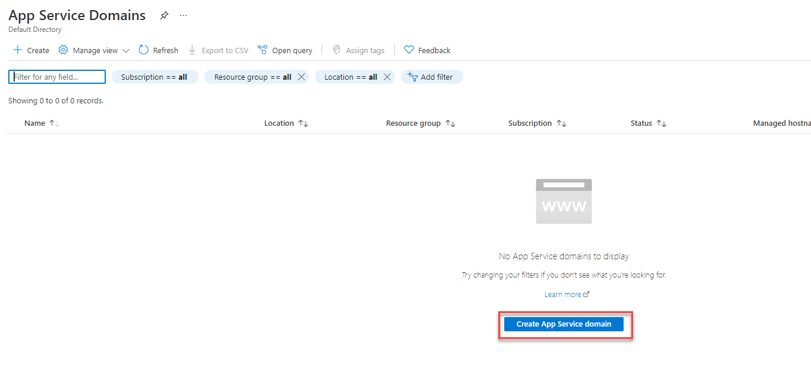

9.  On the **App Service Domain** blade, in the **Search for domain** text box, type the domain name you want to purchase and select the checkbox next to one of the available domain names listed below. Make sure you make note of the domain you choose. 

    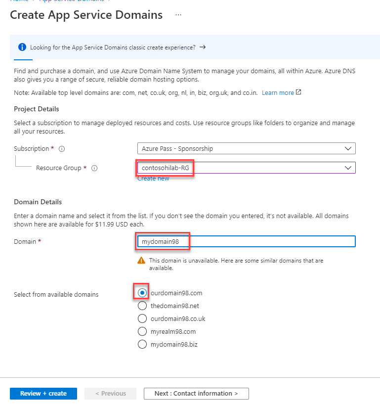

10. Select **Contact information**, type required information, and select **OK**.

11. Select **Privacy protection**, ensure that **Disable** is selected, and select **OK**.

12. Leave the **www** and **\@ (Root domain)** checkboxes unchecked.

13. Select **Legal terms**, select **Accept**, and, back on the **App Service Domain** blade, select **OK**.


### Task 4: Assign a custom domain name to the Contoso Azure AD tenant

In this task, you will assign a newly purchased custom DNS domain name to the Contoso Azure AD tenant. 

1. From the lab computer, in the Azure portal, select the **Directory + Subscription** icon in the toolbar of the Azure portal (to the right of the **Cloud Shell** icon) and switch to the Contoso Azure AD tenant. 
   
   

2. In the Azure portal's left navigation, select **Azure Active Directory** to navigate to the **Contoso - Overview** blade.

3. On the **Contoso - Overview** blade, select **Custom domain names** under **Manage** on the left.

4. On the **Contoso - Custom domain names** blade, select **+ Add custom domain**.

5. On the **Add custom domain** blade, in the **Custom domain name** text box, type the domain name you purchased in the previous task and select **Add domain**. You will be redirected to a new blade displaying your custom domain name settings.

6. Identify the value of the **TXT** record on the custom domain name blade. 

7. From the lab computer, start another browser tab and navigate to the Azure portal.

8. In the Azure portal, select the **Directory + Subscription** icon in the toolbar of the Azure portal (to the right of the **Cloud Shell** icon) to switch to the Azure AD tenant associated with the Azure subscription into which you deployed resources in the Before Hands-On Lab exercises (the **Default Directory**). 

9.  In the Azure portal, select **All services** in the portal's left navigation. In the **Search All** textbox, type **DNS zones**, and then select the **DNS zones** entry in the listing of search results.

    

10. On the **DNS zones** blade, select the entry with the name matching the custom domain name you purchased in the previous task.

11. On the DNS zone blade, select **+ Record set**. 

12. On the **Add record set** blade, specify the following settings and select **OK**:

    - Name: **\@**

    - Type: **TXT**

    - TTL: **1**

    - TTL unit: **Hours**

    - Value: the value of **DESTINATION OR POINTS TO ADDRESS** entry you identified on the custom domain name blade.

13. Switch back to the browser window displaying the custom domain name blade and select **Verify**.

14. Ensure that the verification was successful. 

15. Back on the custom domain name blade, select **Make primary** and confirm the change when prompted. 

    


### Task 5: Configure DNS suffix in the Contoso Active Directory forest

In this task, you will configure the DNS suffix of the Contoso Active Directory forest to match the newly verified Azure AD custom domain name.

1. From the lab computer, in the Azure portal, verify that you are signed in to the Azure AD tenant associated with the Azure subscription into which you deployed resources in the Before Hands-On Lab exercises (the **Default Directory**). If not, select the **Directory + Subscription** icon in the toolbar of the Azure portal (to the right of the **Cloud Shell** icon) to switch to that Azure AD tenant. 

2. In the Azure portal, navigate to the blade of the **DC1** virtual machine.

3. From the **DC1** virtual machine blade, connect to **DC1** via Remote Desktop. When prompted to sign in, use the **demouser** name with the **demo\@pass123** password. 

4. Within the Remote Desktop session to **DC1**, from the **Server Manager** window, start the **Active Directory Domains and Trusts** console under **Tools**. 

    

5. In the **Active Directory Domains and Trusts** console, right-click the **Active Directory Domains and Trusts [DC1.contoso.local]** node and, in the right-click menu, select **Properties**.

    

6. On the **UPN Suffixes** tab of the **Active Directory Domains and Trusts [DC1.contoso.local]** window, in the **Alternative UPN suffixes** textbox, type the name of the custom domain you verified in the previous task, select **Add**, and then select **OK**.

    

7. Within the Remote Desktop session to **DC1**, from the **Server Manager** window, start **Active Directory Users and Computers** console under **Tools**. 

    

8. In the **Active Directory Users and Computers** console, expand the **contoso.local** node and examine the organizational unit hierarchy of the domain and the group membership of the domain groups. 

    

9.  Within the Remote Desktop session to **DC1**, start Windows PowerShell ISE and, from the Script pane, run the following to replace the UPN suffix of all users who are members of the **Engineering** group with the one matching the custom verified domain name of the Contoso Azure AD tenant (replace the placeholder `<custom_domain_name>` with the actual name of the custom verified domain name you assigned to the Contoso Azure AD tenant). 

    ```pwsh
    $domainName = '<custom_domain_name>'
    $users = Get-ADGroupMember -Identity 'Engineering' -Recursive | Where-Object {$_.objectClass -eq 'user'}

    foreach ($user in $users) {
        $user = Get-ADUser -Identity $User.SamAccountName
        $userName = $user.UserPrincipalName.Split('@')[0] 
        $upn = $userName + "@" + $domainName 
        $user | Set-ADUser -UserPrincipalName $upn
    }
    ```

### Task 6: Install Azure AD Connect

In this task, you will install Azure AD Connect.

1. Within the Remote Desktop session to **DC1**, in Server Manager, select **Local Server**, and ensure that **IE Enhanced Security Configuration** is disabled. If not, then select the **On** link next to the **IE Enhanced Security Configuration**, set the **Administrators** settings to **Off**, and select **OK**.

2. Within the Remote Desktop session to **DC1**, start Internet Explorer and navigate to the Azure portal at <https://portal.azure.com>.

3. When prompted to sign in, provide the credentials of the **john.doe** Azure AD user account, which you copied into Notepad earlier in this exercise.

4. When prompted, change the password for the **john.doe** user account. 
  
    > **Note**: If you receive the message **We've seen that password too many times before. Choose something harder to guess**, you'll need to modify the password until it is unique enough to be accepted.

5. If prompted whether to **Stay signed in?"** select **No**. You will be redirected to the Azure portal interface. 

6. If presented with the **Welcome to Microsoft Azure** dialog box, select **Maybe later**. 

7. In the Azure portal, select **Azure Active Directory** to navigate to the **Contoso - Overview** blade.

8. On the **Contoso - Overview** blade, select **Azure AD Connect** under **Manage** on the left.

9.  On the **Azure AD Connect** blade, select the **Download Azure AD Connect** link.

    

10. On the **Microsoft Azure Active Directory Connect** web page of the Microsoft Downloads site, select **Download**.

11. When prompted whether to run or save **AzureADConnect.msi**, select **Run**. This will download the file and automatically start the **Microsoft Azure Active Directory Connect** wizard. 

12. On the **Welcome to Azure AD Connect** page, enable the **I agree to the license terms and privacy notice** checkbox and select **Continue**.

    

13. On the **Express Settings** page, select the **Customize** button.

14. On the **Install required components** page, leave all optional configuration options deselected and select **Install**.

15. On the **User sign-in** page, select the **Pass-through authentication** option and the **Enable single sign-on** checkboxes, and select **Next**.

    

16. On the **Connect to Azure AD** page, sign in by using the credentials of the **john.doe** account and select **Next**.

17. On the **Connect your directories** page, ensure that the **contoso.local** entry appears in the **FOREST** drop-down list and select **Add Directory**. In the **AD forest account**, ensure that the **Create new AD account** option is selected, in the **ENTERPRISE ADMIN USERNAME** textbox, type **CONTOSO\\demouser**, in the **PASSWORD** textbox, type **demo\@pass123**, and select **OK**.

    

18. Back on the **Connect your directories** page, select **Next**.

19. On the **Azure AD sign-in configuration** page, ensure that your custom domain name is listed as the verified **Active Directory UPN Suffix**, and that the **userPrincipalName** entry appears in the **USER PRINCIPAL NAME** drop-down list. Note the warning stating **Users will not be able to sign-in to Azure AD with on-premises credentials if the UPN suffix does not match a verified domain name**. Enable the checkbox **Continue without matching all UPN suffixes to verified domain** and select **Next**. 

    >**Note**: This is expected, since some users are still configured with the **contoso.local** UPN suffix, which is not routable and cannot be configured as a verified custom domain name of an Azure AD tenant.

    

20. On the **Domain and OU filtering** page, ensure that only the **DemoAccounts** OU and all of its children OUs are selected and select **Next**. 

    

21. On the **Uniquely identifying your users** page, accept the default settings and select **Next**. 

    

22. On the **Filter users and devices** page, accept the default settings and select **Next**. 

    

23. On the **Optional features** page, accept the default settings and select **Next**.

    

24. On the **Enable single sign-on** page, select **Enter credentials**, in the **Forest credentials** dialog box, sign in with the **CONTOSO\\demouser** name and **demo\@pass123** password, and select **Next**.

    

25. On the **Ready to configure** page, ensure that the **Start the synchronization process when configuration completes** checkbox is **NOT** selected and select **Install**.

    

   > **Note**: You will configure attribute-level filtering before enabling the synchronization process.

   > **Note**: Installation should take about 2 minutes.

26. On the **Configuration complete** page, select **Exit**.

    


### Task 7: Enable Active Directory Recycle Bin

In this task, you will enable Recycle Bin in the Contoso Active Directory domain. 

1. Within the Remote Desktop session to **DC1**, from the Tools menu in the Server Manager console, start **Active Directory Administrative Center**.

    

2. In the **Active Directory Administrative Center** console, right-click the node representing the contoso.local domain and, in the context sensitive menu, select **Enable Recycle Bin**.

    

3. When prompted to confirm, select **OK**.

4. When prompted to refresh AD Administrative Center, select **OK**.

   > **Note**: For information regarding benefits of the Recycle Bin in hybrid scenarios, refer to <https://docs.microsoft.com/en-us/azure/active-directory/hybrid/how-to-connect-sync-recycle-bin>


### Task 8: Configure Azure AD Connect attribute-level filtering

In this task, you will configure Azure AD Connect attribute level filtering that will limit synchronization of user accounts to those with the UPN suffix matching the custom domain name of the target Azure AD tenant.

   > **Note**: The positive filtering option requires at least two sync rules. One of them determines the correct scope of objects to synchronize. The second catch-all sync rule filters out all objects that have not yet been identified as an object that should be synchronized.

1. Within the Remote Desktop session to **DC1**, start **Synchronization Rules Editor** under **Azure AD Connect** in the Start menu.

    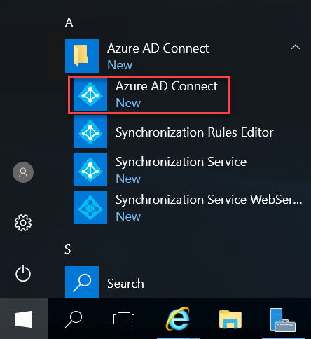

2. In the Synchronization Rules Editor window, on the **View and manage your synchronization rules** page, ensure that **Inbound** appears in the **Direction** drop-down list and select **Add new rule**. This will launch the **Create inbound synchronization rule** wizard.

    

3. On the **Create inbound synchronization rule - Description** page, specify the following settings and select **Next**:

    - Name: **Custom In from AD - UPN Filter**

    - Description: **Custom Inbound Rule - includes users with UPN set to match the Azure AD custom domain**

    - Connected System: **contoso.local**

    - Connected System Object Type: **user**

    - Metaverse Object Type: **person**

    - Link Type: **join**

    - Precedence: **50**

    - Tag: Leave empty

    - Enable Password Sync: Leave empty

    - Disabled: Leave empty

    

4. On the **Create inbound scoping filter** page, select **Add Group**, select **Add clause** specify the following, and select **Next**:

    - Attribute: **userPrincipalName**

    - Operator: **ENDSWITH**

    - Value: **\@\<your custom domain name>**

    

5. On the **Join Rules** page, select **Next**.

6. On the **Transformations** page, select **Add transformation** specify the following and select **Add**:

    - FlowType: **Constant**

    - Target Attribute: **cloudFiltered**

    - Source: **False**

    

7. When presented with a **Warning** dialog box displaying message stating that **A full import and full synchronization will be run on 'contoso.local' during your next synchronization cycle**, select **OK**.

   > **Note**: This should bring you back to the View and manage your synchronization rules interface, with the new rule listed at the top of the rule list. 

    

8. Back in the **Synchronization Rules Editor** window, on the **View and manage your synchronization rules** page, ensure that **Inbound** appears in the **Direction** drop-down list and select **Add new rule** again. This will launch the **Create inbound synchronization rule** wizard.

9.  On the **Description** page, specify the following settings and select **Next**:

    - Name: **Custom In from AD - Catch-all Filter**

    - Description: **Custom Inbound Rule - excludes all users with UPN not set to match the Azure AD custom domain**

    - Connected System: **contoso.local**

    - Connected System Object Type: **user**

    - Metaverse Object Type: **person**

    - Link Type: **join**

    - Precedence: **51**

    - Tag: Leave empty

    - Enable Password Sync: Leave empty

    - Disabled: Leave empty

    

10. On the **Scoping filer** page, select **Next**.

11. On the **Join Rules** page, select **Next**.

12. On the **Transformations** page, select **Add transformation** specify the following and select **Add**:

    - FlowType: **Constant**

    - Target Attribute: **cloudFiltered**

    - Source: **True**

    

13. When presented with a **Warning** dialog box displaying message stating that **A full import and full synchronization will be run on 'contoso.local' during your next synchronization cycle**, select **OK**.

    >**Note**: This should bring you back to the **View and manage your synchronization rules** interface, with the new rules listed at the top of the rule list. 

    


### Task 9: Initiate and verify directory synchronization

1. Within the Remote Desktop session to **DC1**, double-click the **Azure AD Connect** desktop shortcut.

2. On the **Welcome to Azure AD Connect** page, select **Configure**. 

3. On the **Additional tasks** page, select **Customize synchronization options** and select **Next**.

    

4. On the **Connect to Azure AD** page, sign in by using the credentials of the **john.doe** account and select **Next**.

5. On the **Connect your directories** page, select **Next**.

6. On the **Domain and OU filtering** page, select **Next**. 

7. On the **Optional features** page, accept the default settings and select **Next**.

8. On the **Enable single sign-on** page, select **Next**.

9.  On the **Ready to configure** page, select the **Start the synchronization process when configuration completes** checkbox and select **Configure**.

    

10. On the **Configuration complete** page, select **Exit**.

11. Within the Remote Desktop session to **DC1**, in the Internet Explorer window displaying the Azure portal, navigate to the **Users - All users** blade of the Contoso Azure AD tenant.

12. On the **Users - All users** blade, note that the list of user objects includes all user accounts with the UPN suffix matching the custom domain name of the Azure AD tenant. 

13. In the Azure portal, navigate to the **Groups - All groups** blade of the Contoso Azure AD tenant and note that all of the contoso.local domain groups have been synchronized as well. 

14. In the Azure portal, navigate to the **Contoso - Azure AD Connect** blade and select **Azure AD Connect** on the left. Verify that the following settings are set: 

    - Azure AD Connect Sync Status: **Enabled** 
  
    - Last Sync: **The should be a timestamp of some sort** 
  
    - Password Hash Sync: **Disabled** 
  
    - Federation: **Disabled**
   
    - Seamless single sign-on: **Enabled for 1 domain** 
  
    - Pass-through authentication: **Enabled with 1 agent**

   > **Note**: In a production environment, you would install additional agents for redundancy. For more information, refer to <https://docs.microsoft.com/en-us/azure/active-directory/hybrid/how-to-connect-pta-quick-start>.


### Task 10: Configure Hybrid Azure AD join

In this task, you will configure Azure AD Connect device synchronization options.

1. Within the Remote Desktop session to **DC1**, double-click the **Azure AD Connect** desktop shortcut.

2. On the **Welcome to Azure AD Connect** page, select **Configure**. 

3. On the **Additional tasks** page, select **Configure device options** and select **Next**.

4. On the **Overview** page, review the information regarding **Hybrid Azure AD join** and **Device writeback**, and select **Next**.

5. On the **Connect to Azure AD** page, sign in by using the credentials of the **john.doe** account and select **Next**.

6. On the **Device options** page, ensure that the **Configure Hybrid Azure AD join** option is selected and select **Next**. 

    

7. On the **Device operating system** page, select the **Windows 10 or later domain-joined devices** and **Supported Windows down-level domain-joined devices** checkboxes, and select **Next**. 

   > **Note**: Windows down-level devices are supported only if you are using Seamless SSO for managed domains or a federation service such as AD FS for federated domains.

8. On the **SCP configuration** page, enable the checkbox for the **contoso.local** Active Directory forest, select **Azure Active Directory** entry in the **Authentication Service** dropdown list, and select **Add**.

    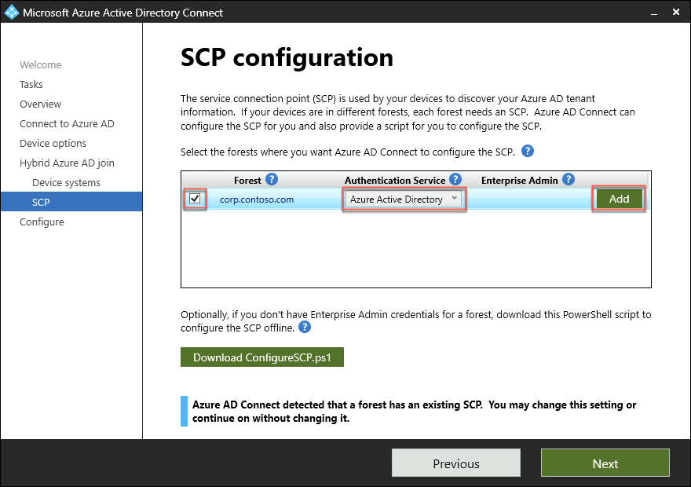

9.  When prompted for Enterprise Admin Credentials for contoso.local, in the **Windows Security** dialog box, sign in with the **CONTOSO\\demouser** user name and **demo\@pass123** password.

10. Back on the **SCP configuration** page, select **Next**.

11. On the **Ready to configure** page, select **Configure**.

12. On the **Configuration complete** page verify that the task completed successfully and select **Exit**.

   > **Note**: For more information regarding configuring hybrid Azure Active Directory join for managed domains, refer to <https://docs.microsoft.com/en-us/azure/active-directory/devices/hybrid-azuread-join-managed-domains#configure-hybrid-azure-ad-join>.


### Task 11: Perform Hybrid Azure AD join

1. From the lab computer, in the Azure portal, verify that you are signed in to the Azure AD tenant associated with the Azure subscription into which you deployed resources in the Before Hands-On Lab exercises (the **Default directory**). If not, select the **Directory + Subscription** icon in the toolbar of the Azure portal (to the right of the **Cloud Shell** icon) to switch to that Azure AD tenant. 

2. In the Azure portal, navigate to the blade of the **APP1** virtual machine.

3. From the **APP1** virtual machine blade, connect to **APP1** via Remote Desktop. When prompted to sign in, use the **AGAyers\@<custom_domain_name>** user name with the **demo@pass123** password (where **<custom_domain_name>** placeholder represents the custom DNS domain name you assigned to the Contoso Azure AD tenant earlier in this exercise.

4. Within Remote Desktop session to **APP1**, from the **Server Manager** window, start **Task Scheduler** under **Tools**. 

    

5. In the **Task Scheduler** console, navigate to **Task Scheduler Library** > **Microsoft** > **Windows** > **Workplace Join**. From there, enable then run the **Automatic-Device-Join** task. 

    

6. Switch to the Remote Desktop session to **DC1** and, from the console pane of the Windows PowerShell ISE window, start Azure AD Connect delta synchronization by running the following:

   ```pwsh
   Import-Module -Name 'C:\Program Files\Microsoft Azure AD Sync\Bin\ADSync\ADSync.psd1'
   
   Start-ADSyncSyncCycle -PolicyType Delta
   ```

7. Switch back to the Remote Desktop session to **APP1** and start a **Command Prompt**.

8. From the Command Prompt window, check the Azure AD registration status of APP1 by running the following: 

   ```
   dsregcmd /status
   ```

9.  Verify that the output of the command resembles the following:

   ```
   +----------------------------------------------------------------------+
   | Device State                                                         |
   +----------------------------------------------------------------------+

        AzureAdJoined : YES
     EnterpriseJoined : NO
             DeviceId : 61eea2b8-efbe-43d9-b267-126433c8ee34
           Thumbprint : BBAAA0FB4A55E880388851BED955A2669A961A96
       KeyContainerId : 2eb75eb8-0a1d-437b-99d9-9dd161ca0d90
          KeyProvider : Microsoft Software Key Storage Provider
         TpmProtected : NO
         KeySignTest: : PASSED
                  Idp : login.windows.net
             TenantId : xxxxxxx-xxxx-xxx-xxxx-xxxxxxxxxx
           TenantName : xxxxxxx-xxxx-xxx-xxxx-xxxxxxxxxx
          AuthCodeUrl : https://login.microsoftonline.com/xxxxxxx-xxxx-xxx-xxxx-xxxxxxxxxx/oauth2/authorize
       AccessTokenUrl : https://login.microsoftonline.com/xxxxxxx-xxxx-xxx-xxxx-xxxxxxxxxx/oauth2/token
               MdmUrl :
            MdmTouUrl :
     MdmComplianceUrl :
          SettingsUrl :
       JoinSrvVersion : 1.0
           JoinSrvUrl : https://enterpriseregistration.windows.net/EnrollmentServer/device/
            JoinSrvId : urn:ms-drs:enterpriseregistration.windows.net
        KeySrvVersion : 1.0
            KeySrvUrl : https://enterpriseregistration.windows.net/EnrollmentServer/key/
             KeySrvId : urn:ms-drs:enterpriseregistration.windows.net
         DomainJoined : YES
           DomainName : CONTOSO

   +----------------------------------------------------------------------+
   | User State                                                           |
   +----------------------------------------------------------------------+

               NgcSet : NO
      WorkplaceJoined : NO
        WamDefaultSet : NO
           AzureAdPrt : NO

   +----------------------------------------------------------------------+
   | Ngc Prerequisite Check                                               |
   +----------------------------------------------------------------------+

        IsUserAzureAD : NO
        PolicyEnabled : NO
       DeviceEligible : YES
   SessionIsNotRemote : NO
     X509CertRequired : NO
         PreReqResult : WillNotProvision

   ```
11. Switch back to the Remote Desktop session to **DC1**, in the Internet Explorer window displaying the Azure portal, navigate to the **Devices - All devices** blade of the Contoso Azure AD tenant and verify that there is an entry representing the APP1 server, with the **Join Type** set to **Hybrid Azure AD joined**.

   > **Note**: You might need to wait until the Azure AD registration status is correctly reported and its Azure AD object appears in the Azure portal.

   


### Summary

In this exercise, you integrated an Active Directory forest with an Azure Active Directory tenant by creating an Azure Active Directory tenant and activating an Enterprise Mobility + Security E5 trial, creating and configuring an Azure AD user, purchasing a custom domain name, assigning a custom domain name to the Contoso Azure AD tenant, configuring DNS suffix in the Contoso Active Directory forest, installing Azure AD Connect, enable Active Directory Recycle Bin, configuring Azure AD Connect attribute-level filtering, initiating and verifying directory synchronization, configuring Hybrid Azure AD join, and performing Hybrid Azure AD join of a Windows Server 2016 VM.


## Exercise 2: Manage Authentication, Authorization, and Access Control in Hybrid Scenarios

Duration: 150 minutes

### Overview

In this exercise, you will optimize authentication, authorization, and access control for Contoso Active Directory environment integrated with the Contoso Azure AD tenant by enabling Azure AD Multi-Factor Authentication, enabling Azure AD password writeback and Self-Service Password Reset, implementing, Azure AD Password Protection, enabling Azure Active Directory Identity Protection, enabling Automatic Intune Enrollment, as well as implementing Azure AD Privileged Identity Management and Azure AD Conditional Access Policies.


### Task 1: Create Active Directory groups

In this task, you will create and configure Active Directory groups that will be used to control authentication, authorization, and access control and synchronize them to the Contoso Azure AD tenant. 

1. Within the Remote Desktop session to **DC1**, from the **Server Manager** window, under **Tools** start the **Active Directory Users and Computers** console. 

2. In the **Active Directory Users and Computers** console, expand the **contoso.local** node and navigate to the **Demo Accounts > Groups**. 

    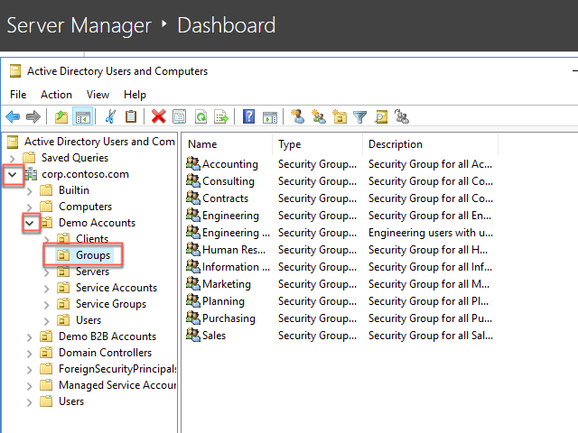

3. In the **Groups** directory, right-click then select **New** then select **Group**. Create a new group with the following settings and select **OK**:

    - Group name: **Engineering - Mandatory MFA**

    - Group name (pre-Windows 2000): **Engineering - Mandatory MFA**

    - Group scope: **Global**

    - Group type: **Security**

    

4. Open the **Properties** window of the **Engineering - Mandatory MFA** group, in the **Description** text box, type **Engineering users with user state-based MFA enforcement (without Conditional Access)** then select **Apply** then **OK**.

5. Within the Remote Desktop session to **DC1**, from the Script pane of the Windows PowerShell ISE window, run the following to add designated users to the newly created group (replace the placeholder `<custom_domain_name>` with the actual name of the custom verified domain name you assigned to the Contoso Azure AD tenant).

    ```pwsh
    $domainName = '<custom_domain_name>'
    $users = Get-ADGroupMember -Identity 'Engineering' -Recursive | Where-Object {($_.objectClass -eq 'user') -and ($_.distinguishedName -like "*OU=NY,OU=US,OU=Users,OU=Demo Accounts,DC=contoso,DC=local")}
    foreach ($user in $users) {
        $user = Get-ADUser -Identity $User.SamAccountName
        Add-ADGroupMember -Identity 'Engineering - Mandatory MFA' -Members $user
    }
    ```

6. From the console pane of the Windows PowerShell ISE window, start Azure AD Connect delta synchronization by running the following:

   ```pwsh
   Import-Module -Name 'C:\Program Files\Microsoft Azure AD Sync\Bin\ADSync\ADSync.psd1'
   
   Start-ADSyncSyncCycle -PolicyType Delta
   ```

7. In the Remote Desktop session to **DC1**, in the Internet Explorer window displaying the Azure portal, navigate to the **Contoso - Overview** blade of the Contoso Azure AD tenant and select **Groups** on the left.

8. On the **Groups - All groups** blade, verify that there is an entry representing the **Engineering - Mandatory MFA** group containing the Azure AD user accounts matching Active Directory user accounts which are members of the Active Directory **Engineering - Mandatory MFA** group.


### Task 2: Assign EMS E5 licenses to Azure AD users

In this task, you assign a value to the **UsageLocation** attribute of each user account and assign an Azure AD Premium license to each user. This is necessary in order to implement Azure AD-based Multi-Factor Authentication for these users.

1. Within the Remote Desktop session to **DC1**, from the Script pane of the Windows PowerShell ISE window, run the following to install Azure AD Graph PowerShell module for Graph (select **Yes to All** when prompted whether to proceed with the installation):

    ```pwsh
    Install-Module AzureAD
    ```

2. From the Script pane of the Windows PowerShell ISE window, run the following to sign in to the Contoso Azure AD tenant. When prompted, sign in with the **john.doe** Azure AD user account, which you created in the previous exercise.

    ```pwsh
    Connect-AzureAD
    ```

3. From the Script pane of the Windows PowerShell ISE window, run the following to set the **Location** attribute to **United States** for all Azure AD user accounts with the UPN suffix matching the custom verified domain name of the Contoso Azure AD tenant. 

    ```pwsh
    $domainName = (Get-AzureADDomain | Where-Object IsDefault -eq 'True').Name
    Get-AzureADUser | Where-Object {$_.UserPrincipalName -like "*@$domainName"} | Set-AzureADUser -UsageLocation 'US'
    ```
4. From the Script pane of the Windows PowerShell ISE window, run the following to assign the EM+S E5 trial licenses to all Azure AD user accounts with the UPN suffix matching the custom verified domain name of the Contoso Azure AD tenant. 

    ```pwsh
    $license = New-Object -TypeName Microsoft.Open.AzureAD.Model.AssignedLicense
    $license.SkuId = (Get-AzureADSubscribedSku | Where-Object {$_.SkuPartNumber -eq 'EMSPREMIUM'}).SkuId
    $licensesToAssign = New-Object -TypeName Microsoft.Open.AzureAD.Model.AssignedLicenses
    $licensesToAssign.AddLicenses = $license
    $users = Get-AzureADUser | Where-Object {$_.UserPrincipalName -like "*@$domainName"}
    foreach($user in $users) { 
        Set-AzureADUserLicense -ObjectId $user.ObjectId -AssignedLicenses $licensesToAssign
    }
    ```

### Task 3: Enable Azure AD Multi-Factor Authentication

In this task, you will configure user state-based Azure AD Multi-Factor Authentication for members of the **Engineering - Mandatory MFA** group.

   > **Note**: In general, enabling Azure Multi-Factor Authentication using Conditional Access policies is the recommended approach, since it offers more flexibility. Setting Multi-Factor Authentication by modifying the user state requires users to perform two-step verification every time they sign in and overrides Conditional Access policies. On the other hand, this approach might be required if existing licensing arrangement does not include Conditional Access.

1. Within the Remote Desktop session to **DC1**, from the Script pane of the Windows PowerShell ISE window, run the following to install Azure AD MSOnline PowerShell module for Graph (select **Yes to All** when prompted whether to proceed with the installation):

    ```pwsh
    Install-Module MSOnline
    ```

2. From the Script pane of the Windows PowerShell ISE window, run the following to sign in to the Contoso Azure AD tenant. When prompted, sign in with the **john.doe** Azure AD user account, which you created in the previous exercise.

    ```pwsh
    Connect-MsolService
    ```

3. From the Script pane of the Windows PowerShell ISE window, run the following to enable Azure AD Multi-Factor Authentication for all Azure AD user accounts with the UPN suffix matching the custom verified domain name of the Contoso Azure AD tenant. 

    ```pwsh
    $objectIdGUID = (Get-MsolGroup | Where-Object {$_.DisplayName -eq 'Engineering - Mandatory MFA'}).objectId.Guid
    $users = Get-MsolGroupMember -GroupObjectId $objectIdGUID
    $st = New-Object -TypeName Microsoft.Online.Administration.StrongAuthenticationRequirement
    $st.RelyingParty = "*"
    $st.State = "Enabled"
    $sta = @($st)
    foreach($user in $users) { 
        Set-MsolUser -ObjectId $user.ObjectId -StrongAuthenticationRequirements $sta
    }
    ```

4. To verify the outcome, within the Remote Desktop session to **DC1**, in the Internet Explorer window displaying the Azure portal, navigate to the **Users - All users** blade of the Contoso Azure AD tenant and select **Multi-Factor Authentication** (you might need to select **...** first). This will open a new tab in the Internet Explorer window displaying the **multi-factor authentication** portal.

    

5. In the **multi-factor authentication** portal, on the **users** tab, ensure that all users have the **MULTI-FACTOR AUTH STATUS** set to **Enabled**. If all or some do not have multi-factor authentication enabled, select all users, then select **Enable** on the right. Select **enable multi-factor auth** when prompted. Wait for the operation to complete. 

    


### Task 4: Enable password writeback and Self-Service Password Reset

In this task, you will enable password writeback and Self-Service Password Reset (SSPR) for Contoso users that had their accounts synchronized to the Contoso Azure AD tenant.

1. Within the Remote Desktop session to **DC1**, double-click the **Azure AD Connect** desktop shortcut.

2. On the **Welcome to Azure AD Connect** page, select **Configure**. 

3. On the **Additional tasks** page, select **Customize synchronization options** and select **Next**.

4. On the **Connect to Azure AD** page, sign in by using the credentials of the **john.doe** account and select **Next**.

5. On the **Connect your directories** page, select **Next**.

6. On the **Domain and OU filtering** page, select **Next**. 

7. On the **Optional features** page, select the **Password writeback** checkbox and select **Next**.

8. On the **Enable single sign-on** page, select **Next**.

9.  On the **Ready to configure** page, ensure that the **Start the synchronization process when configuration completes** checkbox is selected and select **Configure**.

10. On the **Configuration complete** page, select **Exit**.

11. Within the Remote Desktop session to **DC1**, in the Internet Explorer window displaying the Azure portal, navigate to the **Contoso - Overview** blade of the Contoso Azure AD tenant.

12. On the **Contoso - Overview** blade, select **Password reset** on the left under **Manage**. 

13. On the **Password reset - Properties** blade, set **Self-service password reset enabled** to **Selected**, choose **Select group**, on the **Default password reset policy**, select **Engineering**, choose **Select**, and select **Save**.

14. On the **Password reset - Properties** blade, select **Authentication methods** on the left under **Manage**.

15. On the **Password reset - Authentication methods** blade, set **Number of methods required to reset** to **2**, enable all **Methods available to users**, including **Mobile app notification**, **Mobile app code**, **Email**, **Mobile phone (SMS only)**, and **Security questions**. 

    

   > **Note**: The **Office phone** method is not available in trial subscriptions.

16. Set **Number of security questions required to register** and **Number of questions required to reset** to **3**. 

    

17. Choose **Select security questions**. On the **Select security questions** blade, select **+ Predefined**, on the **Add predefined security questions** blade, select any 5 questions, select **OK** twice, and, back on the **Password reset - Authentication methods** blade, select **Save**.

    

18. On the **Password reset - Authentication methods** blade, select **Registration** on the left and ensure that **Require users to register when signing in** is set to **Yes** and that **Number of days before users are asked to re-confirm their authentication information** is set to **180**.

19. On the **Password reset** blade, select **On-premises integration** on the left and verify that the **Write back passwords to your on-premises directory** setting is set to **Yes**. Note that you have the option to **Allow users to unlock accounts without resetting their passwords**.


### Task 5: Implement Azure AD Password Protection for Windows Server Active Directory

In this task, you will implement Azure AD password Protection for Windows Server Active Directory.

1. Within the Remote Desktop session to **DC1**, from the **Server Manager** window, under **Tools** start **Group Policy Management** console. 

2. In the **Group Policy Management** console, navigate to the **Forest: contoso.local > Domains > contoso.local** node, right select **Default Domain Policy** and, in the right-click menu, select **Edit**. 

    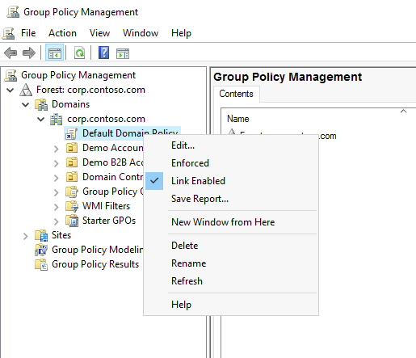

3. In the **Group Policy Management Editor**, navigate to **Computer Configuration > Policies > Windows Settings > Security Settings > Account Policies > Account Lockout Policy**. 

4. Set the value of the **Account lockout threshold** to **10** and select **OK** and accept the settings in the **Suggested Value Changes**. 

    

5. Within the Remote Desktop session to **DC1**, in the Internet Explorer window displaying the Azure portal, navigate to the **Contoso - Overview** blade of the Contoso Azure AD tenant.

6. On the **Contoso - Overview** blade, select **Security** under **Manage** on the left.

7. On the **Security - Getting started** blade, select **Authentication methods** under **Manage** on the left.

8. On the **Authentication methods - Authentication methods policy (Preview)** blade, select **Password protection** under **Manage** on the left.

9.  On the **Authentication methods - Password protection** blade, specify the following settings and select **Save**:

    - Lockout threshold: **5**

    - Lockout duration in seconds: **3600**

    - Enforce custom list: **Yes**

    - Custom banned password list: **Contoso**, **password**, **pass** (type each word on a separate line without commas).

    - Enable password protection on Windows Server Active Directory: **Yes**

    - Mode: **Audit**

    

10. Switch to the Remote Desktop session to **APP1** virtual machine, where you are signed in as the user **AGAyers** with the **demo@pass123** password. 

11. Within the Remote Desktop session to **APP1**, start Internet Explorer, navigate to the **Azure AD Password Protection for Windows Server Active Directory** page at <https://www.microsoft.com/download/details.aspx?id=57071> and download **AzureADPasswordProtectionProxySetup.exe**. Run the installation of the **Azure AD Password Protection Proxy Bundle** with the default options.

    **Note:** You may have to enable file download on Internet Explorer. To do this, select **Tools** in the top right of the window and select **Internet Options**. From there select the **Security** tab then select **Custom level**. In the pop-up, scroll to the downloads section. Select **Enable** under **File download** and then select **OK**. Select **Yes** at the confirmation prompt then select **OK** again. 

12.  Within the Remote Desktop session to **APP1**, start Windows PowerShell ISE as Administrator and, from the console pane, run the following to register the proxy (replace the `<domain_name>` placeholder with the name of the default domain name associated with the Contoso Azure AD tenant). When prompted, sign in to the Contoso Azure AD tenant using credentials of the **john.doe** user account.
13.  
    ```pwsh
    Import-Module AzureADPasswordProtection
    Register-AzureADPasswordProtectionProxy -AccountUpn 'john.doe@<domain_name>.onmicrosoft.com'
    ```

14. From the Administrator: Windows PowerShell ISE console, run the following to register the Active Directory forest (replace the `<domain_name>` placeholder with the name of the default domain name associated with the Contoso Azure AD tenant):

    ```pwsh
    Register-AzureADPasswordProtectionForest -AccountUpn 'john.doe@<domain_name>.onmicrosoft.com'
    ```

15. Switch to the Remote Desktop session to **DC1** virtual machine, where you are signed in as the user **CONTOSO\demouser** with the **demo@pass123** password. 

16. Within the Remote Desktop session to **DC1**, start Internet Explorer, navigate to the **Azure AD Password Protection for Windows Server Active Directory** page at <https://www.microsoft.com/download/details.aspx?id=57071> and download **AzureADPasswordProtectionDCAgentSetup.exe**. Run the **Azure AD Password Protection DC Agent Setup** installation with the default options.

    **Note:** You may have to perform the instructions to enable file download on Internet Explorer listed earlier. 

17. Restart DC1 once the setup completes.


### Task 6: Enable Azure Active Directory Identity Protection

In this task, you will enable Azure AD Identity Protection

1. From the lab computer, in the Azure portal, navigate to the blade of the **DC1** virtual machine. You will need to be in the **Default Directory**. 

2. From the **DC1** virtual machine blade, connect to **DC1** via Remote Desktop. When prompted to sign in, use the **demouser** name with the **demo\@pass123** password. 

3. Within the Remote Desktop session to **DC1**, start Internet Explorer and navigate to the Azure portal at <https://portal.azure.com>.

4. When prompted to sign in, provide the credentials of the **john.doe** Azure AD user account, which you copied into Notepad earlier in this exercise.

5. In the Azure portal, select **+ Create a resource**.

6. On the **New** blade, in the **Search the Marketplace** text box, type **Identity Protection** and, in the list of search results, select **Azure AD Identity Protection**. 

    

7. On the **Azure AD Identity Protection** blade, select **Create** twice.

8. In the Azure portal, navigate to the **All services** blade, in the **Search All** text box, type **Azure AD Identity Protection** blade, and, in the list of results, select **Azure AD Identity Protection**.

9.  On the **Azure AD Identity Protection** blade, select **MFA registration policy** on the left under **Protect**.

10. On the **Azure AD Identity Protection - MFA registration policy** blade, in the **Assignments** section, select **Users**. 

    

11. On the **Users** blade, on the **Include** tab, choose **Select individual users and groups**, then **Select users**, on the **Select users** blade, in the **Select** text box, type **Engineering**, in the list of results, select **Engineering** and choose **Select**.

    

12. On the **Users** blade, on the **Exclude** tab, choose **Select excluded users**, on the **Select users** blade, in the **Select** text box, type **Engineering - Mandatory MFA**, in the list of results, select **Engineering - Mandatory MFA**, choose **Select**, and, back on the **Users** blade, select **Done**.

    

13. Back on the **Azure AD Identity Protection - MFA registration policy** blade, in the **Controls** section, select **Access**. On the **Access** blade, ensure that the **Require Azure MFA registration** checkbox is selected, and choose **Select**.

14. Back on the **Azure AD Identity Protection - MFA registration policy** blade, set **Enforce Policy** to **On** and select **Save**

    

15. On the **Azure AD Identity Protection** blade, select **User risk policy** on the left under **Protect**.

16. On the **Azure AD Identity Protection - User risk policy** blade, configure the **User risk remediation policy** with the following settings and save your configuration:

    - Assignments: 

        - Users: **All users**

        - Conditions:

            - User risk: **Low and above**

    - Controls:

        - Access: **Allow access** and **Require password change**

    - Enforce Policy: **On**

    


### Task 7: Enable Automatic Intune Enrollment

In this task, you will enable automatic enrollment of hybrid Azure AD devices into Intune. 

1. Within the Remote Desktop session to **DC1**, in the Internet Explorer window displaying the Azure portal, navigate to the **All services** blade.

2. On the **All services** blade, search for **Intune** and, in the list of results, select **Intune**.

3. On the **Microsoft Intune - Overview** blade, select **Device enrollment** under **Manage** on the left.

4. On the **Device enrollment** blade, select **Windows enrollment** under **Manage** on the left.

5. On the **Windows enrollment** blade, select **Automatic Enrollment**.

6. On the **Configure** blade, set **MDM user scope** to **All** and select **Save**.

    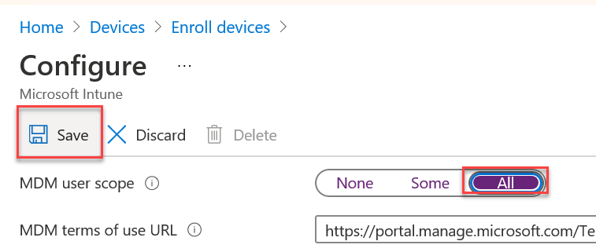

### Task 8: Enable Enterprise-State-Roaming

1. Within the Remote Desktop session to **DC1**, in the Internet Explorer window displaying the Azure portal, navigate to the blade of the Contoso Azure AD tenant.

2. On the **Contoso - Overview** blade, select **Devices** under **Manage** on the left.

3. On the **Devices - All devices** blade, select **Enterprise State Roaming** on the left.

4. On the **Devices - Enterprise State Roaming** blade, for **Users may sync settings and app data across devices**, select **Selected**. Choose **Selected** below. Select **Add** then select the **Engineering** group from the list of Azure AD tenant users and groups. Choose **Select**, then **Ok**, then **Save**. 

    

### Task 9: Implement Azure AD Conditional Access Policies

In this task, you will implement Azure AD Conditional Access Policies.

1. Within the Remote Desktop session to **DC1**, in the Internet Explorer window displaying the Azure portal, navigate to the **Contoso - Overview** blade of the Contoso Azure AD tenant.

2. On the **Contoso - Overview** blade, select **Security** under **Manage** on the left.

3. On the **Security - Getting started** blade, select **Named locations** under **Manage** on the left.

4. On the **Security - Named locations** blade, select **+ New location**.

5. On the **New named location** blade, specify the following settings and select **Create**:

    - Name: **Contoso Headquarters**

    - Define the location using: **IP ranges**

    - Mark as trusted location: **enabled**

    - IP ranges: **The public IP address of the APP1 Azure VM (this can be found on it's page in the portal) in the CIDR notation (i.e. x.x.x.x/32).**

    

6. On the **Security - Named locations** blade, select **Configure MFA trusted IPs**. This will open a new tab in the Internet Explorer window displaying the **service settings** tab of the **multi-factor authentication** portal.

    

7. On the **service settings** tab, in the **trusted ip** text box, type the same public IP address of the APP1 Azure VM (this can be found on its page in the portal) in the CIDR notation (i.e. x.x.x.x/32). and select **Save** at the bottom.

8. Navigate back to the **Security - Getting started** blade and select **Conditional Access** under **Protect** on the left.

9.  On the **Conditional Access - Policies** blade, select **+ New policy**.

10. On the **New** blade, in the **Name** text box, type **Contoso Engineering On-Premises Conditional Access Policy**.

11. On the **New** blade, in the **Assignments** section, select **Users and groups**.

12. On the **Users and groups** blade, on the **Include** tab, choose the **Select users and groups** option, select the **Users and groups** checkbox. Select the **Select** button. On the **Select** blade, type **Engineering**, in the list of results, select **Engineering**, and choose **Select**.

    

13. On the **Users and groups** blade, on the **Exclude** tab, select the **Users and groups** checkbox. Choose **Select excluded users**. On the **Select excluded users** blade, type **Engineering**, in the list of results, select **Engineering - Mandatory MFA**, and choose **Select**.

    

14. Back on the **Users and groups** blade, select **Done**.

15. On the **New** blade, in the **Assignments** section, select **Cloud apps or actions**.

16. On the **Cloud apps or actions** blade, on the **Include** tab, choose the **Select apps** option. Choose **Select**. On the **Select** blade, select the **Microsoft Azure Management** checkbox, choose **Select**, and then select **Done**.

    

   > **Note**: Review the warning stating **Don't lock yourself out! This policy impacts the Azure portal. Before you continue, ensure that you or someone else will be able to get back into the portal**. Disregard this warning if you are configuring persistent browser session policy that works correctly only if "All cloud apps" are selected.

18. On the **New** blade, in the **Assignments** section, select **Conditions**.

19. On the **Conditions** blade, select **Sign-in risk**, set **Configure** to **Yes**, enable the **No risk** checkboxes, and choose **Select**.

    

20. Back on the **Conditions** blade, select **Device platforms**, on the **Device platforms** blade, set **Configure** to **Yes**, on the **Include** tab, choose **Select device platforms**, enable the **Windows** checkbox, and select **Done**.

    

21. Back on the **Conditions** blade, select **Locations**, on the **Locations** blade, set **Configure** to **Yes**, on the **Include** tab, choose **Selected locations**, then **Select**, on the **Select** blade, enable the **Contoso Headquarters** checkbox, choose **Select**, and then, on the **Locations** blade, choose **Select**.

    

22. Back on the **Conditions** blade, select **Client apps (Preview)**, on the **Client apps (Preview)** blade, set **Configure** to **Yes**, enable the **Browser**, **Mobile apps and desktop clients**, **Modern authentication clients**, **Exchange ActiveSync clients**, and **Other clients** checkboxes, and select **Done**.

    

23. Back on the **Conditions** blade, select **Device state (Preview)**, on the **Device state (Preview)** blade, set **Configure** to **Yes**, on the **Include** tab, select the **All device state** option and select **Done**.

    

24. Back on the **Conditions** blade, select **Done**.

25. Back on the **New** blade, in the **Access controls** section, select **Grant**.

26. On the **Grant** blade, ensure that the **Grant access** option is selected, enable the checkbox **Require Hybrid Azure AD joined device**, accept the default choice of **Require all the selected controls** for multiple controls, and choose **Select**.

    > **Note**: Review the warning **Don't lock yourself out! Make sure that your device is Hybrid Azure AD Joined**.

    

27. Back on the **New** blade, in the **Access controls** section, select **Session**. 

28. Review the **Session** blade settings but do not modify them. Close it when you are finished.

29. On the **New** blade, set **Enable policy** to **On** and select **Create**

    

30. Back on the **Conditional Access - Policies** blade, select **What If**.

31. On the **What If** blade, specify the following settings and select **What If**:

    - User: **Teresa F. Bell**

    - Cloud apps or actions: **Microsoft Azure Management**

    - IP address: **The public IP address of the APP1 Azure VM**

    - Country or region: **United States**

    - Device platform: **Windows**

    - Client apps (Preview): **Browser**

    - Device state (Preview): **Device Hybrid AD Joined**

    - Sign-in risk: **No risk**

32. Review the evaluation results and note the policy and the grant controls that will apply.

    

33. Re-run the evaluation but first change the **Sign-in risk** to **Low** and review the evaluation results.


### Task 10: Implement Azure AD Privileged Identity Management

In this task, you will implement Azure AD Privileged Identity Management.

1. Within the Remote Desktop session to **DC1**, in the Internet Explorer window displaying the Azure portal, navigate to the **All services** blade.

2. In the search text box, type **Privileged Identity Management** and, in the list of results, select **Azure AD Privileged Identity Management**.

3. On the **Privileged Identity Management** blade, select **Consent to PIM** on the left.

4. On the **Privileged Identity Management - Consent to PIM** blade, select **Verify my identity**. 

5. When prompted to provide additional information, select **Next**, on the **Additional security verification** page, specify the following settings:

    - **Step 1: How should we contact you?**

        - Authentication phone: select your country or region and specify a mobile phone number you intend to use in this lab.

        - Method: **Send me a code by text message**

        - Select **Next**

    - **Step 2: We've sent a text message to your phone**

        - Use the code in the text message you received, select **Verify**, and following successful verification, select **Done**.

    

6. Navigate back to the **Privileged Identity Management** blade, select **Consent to PIM**, select **Consent**, when prompted for a confirmation to proceed, select **Yes**, and refresh the Internet Explorer window.

7. In the Azure portal, from the **Privileged Identity Management** blade, select **Azure AD roles** under **Manage** on the left. 

8. On the **Azure AD roles - Quick start** blade, select **Sign up PIM for Azure AD Roles** on the left, select **Sign up**, when prompted for a confirmation, select **Yes**, and refresh the Internet Explorer window.

9.  On the **Azure AD roles - Overview** blade, select **Roles** under **Manage** on the left.

10. On the **Azure AD roles - Roles** blade, select **Add assignments**.

11. On the **Add assignments** blade, specify the following settings to designate **Ann G. Ayers** as an eligible member of the **Authentication Administrator** role then select **OK**. 

    - Select role: **Authentication Administrator**

    - Select members: **Ann G. Ayers**
  
    - Assignment type: **Eligible**

   > **Note**: **Authentication Administrator** role grants privileges to set or reset non-password credentials and update passwords for all users. Authentication Administrators can require users to re-register against existing non-password credential (for example, MFA or FIDO) and revoke remember MFA on the device, which prompts for MFA on the next sign-in.

12. On the **Azure AD roles - Roles** blade, select **Assignments** under **Manage** on the left and note that **Ann G. Ayers** is listed as eligible for the **Authentication Administrator** role.

13. Switch to the Remote Desktop session to **APP1**, start Internet Explorer, and browse to the Azure portal at [**http://portal.azure.com**](http://portal.azure.com). From here sign-in as Ann G. Ayers. The username can be found on the **Users - All users** page in the Azure portal window on the lab computer. The password will be **demo@pass123**. 

14. When prompted to provide additional information, select **Next**, on the **Additional security verification** page, specify the following settings:

    - **Step 1: How should we contact you?**

        - Authentication phone: select your country or region and specify a mobile phone number you intend to use in this lab.

        - Method: **Send me a code by text message**

    - **Step 2: We've sent a text message to your phone**

        - Use the code in the text message you received, select **Verify**.

    - **Step 3: Keep using your existing application**

        - Note that you have the option of using **app password** and select **Done**.

15. When prompted again to provide additional information, select **Next**, on the **confirm your current password** page, select **re-enter my password**, and, when prompted, provide the password for the Active Directory user account of **Ann G. Ayers**.

16. When prompted, type the code sent to the mobile phone you specified previously and select **Verify**.

17. If brought to the **don't lose access to your account!** page, select **Verify** next to the **Authentication Phone** entry and then select **text me**. Next, type the code send to your mobile phone and select **verify**.

18. On the **don't lose access to your account!** page, select **Set it up now** next to the **Authentication Email is not configured** entry. Next, in the **Authentication Email** text box, type an email address that you want to use for verification and select **email me**.

19. Retrieve the email with the code, type it in the textbox next to the **verify** button, and select **verify**

20. On the **don't lose access to your account!** page, select **Set them up now** next to the **Security Questions are not configured** entry. Next, select each security question, provide the corresponding answer, and select **save answers**.

21. On the **don't lose access to your account!** page, select **finish**. You will be redirected to the Azure portal.

22. In the Azure portal, navigate to the **Privileged Identity Management - Quick start** blade. 

23. On the **Privileged Identity Management - Quick start** blade, select **My roles** on the left.

24. On the **My roles - Azure AD roles** blade, on the **Eligible roles** tab, select **Activate** next to the **Authentication Administrator** role entry. 

25. On the **Authentication Administrator** blade, select **Activate**.

26. On the **Activation** blade, accept the default activation start time and duration (1 hour) type a reason for the activation in the **Activation reason** text box, and select **Activate**.

    

27. On the **Activation status**, monitor changes to your activation request. Once the activation is completed, select the **Sign out** link and then sign in back to the Azure portal to start using your newly activated role.

28. In the Azure portal, navigate back to the **My roles - Azure AD roles** blade.

29. On the **My roles - Azure AD roles** blade, on the **Active roles** tab, note that the role assignment has been activated. 

### Summary

In this exercise, you optimized authentication, authorization, and access protection for Contoso Active Directory environment integrated with the Contoso Azure AD tenant by enabling Azure AD Multi-Factor Authentication, enabling Azure AD password writeback and Self-Service Password Reset, implementing, Azure AD Password Protection, enabling Azure Active Directory Identity Protection, enabling Automatic Intune Enrollment, as well as implementing Azure AD Privileged Identity Management and Azure AD Conditional Access Policies.


## Exercise 3: Configure application access in hybrid scenarios

Duration: 90 minutes

### Overview

In this exercise, you will configure access to on-premises Integrated Windows Authentication app (implemented as the default IIS web site) from the internet by installing and configuring Azure AD Application Proxy. You will test access to this application by using a Contoso Azure AD tenant user account as well as by using a Fabrikam Azure AD tenant user account configured as a guest account in the Contoso Azure AD tenant. 


### Task 1: Install and configure Azure AD Application Proxy

In this task, you will install and configure Azure AD Application Proxy.

1. Within the Remote Desktop session to **DC1**, in the Internet Explorer window displaying the Azure portal, navigate to the **Contoso - Overview** blade of the Contoso Azure AD tenant.

2. On the **Contoso - Overview** blade of the Contoso Azure AD tenant, select **Application proxy** under **Manage** on the left.

3. On the **Contoso - Application proxy** blade, select **Download connector service** link.

4. On the **Application Proxy Connector Download** blade on the right, review the system requirements and select **Accept terms & Download**.

5. When prompted whether to save or run **AADApplicationProxyConnectorInstaller.exe**, select **Run**.

   > **Note**: In a production environment, you would install the connector on a domain member server. We are using a domain controller strictly for simplicity.

6. Install Microsoft Azure Active Directory Application Proxy Connector with default settings. When prompted to sign in, provide the credentials of the **john.doe** Azure AD user account, which you created in the first exercise of this lab.

7. Refresh the Internet Explorer page displaying the **Contoso - Application proxy** blade and verify that it includes the **DC1.contoso.local** entry in the **Default** connector group.

    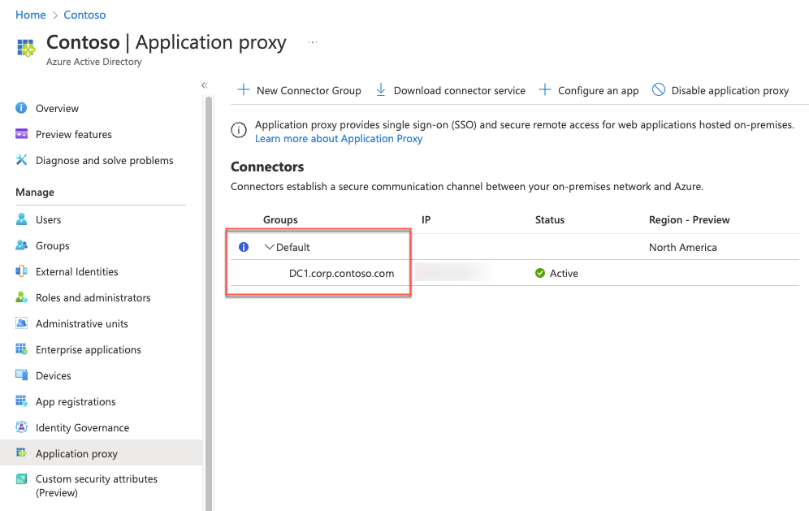

8. On the **Contoso - Application proxy** blade, select **Enable application proxy** and, when prompted for confirmation, select **Yes**.


### Task 2: Configure an Azure AD Application Proxy application

In this task, you will configure an Azure AD Application Proxy application.

1. On the **Contoso - Application proxy** blade, select **+ Configure an app**.

2. On the **Add your own on-premises application** blade, specify the following settings and select **+ Add**.

    - Name: **APP1 Default Web Site**

    - Internal Url: **http://app1.contoso.local**

    - External Url: **Accept the default value**

    - Pre Authentication: **Azure Active Directory**

    - Connector Group: **Default**

    - Backend Application Timeout: **Default**

    - Use HTTP-Only Cookie: **No**

    - Use Secure Cookie: **Yes**

    - Use Persistent Cookie: **No**

    - Translate URLs in Headers: **Yes**

    - Translate URLs in Application Body: **No**

    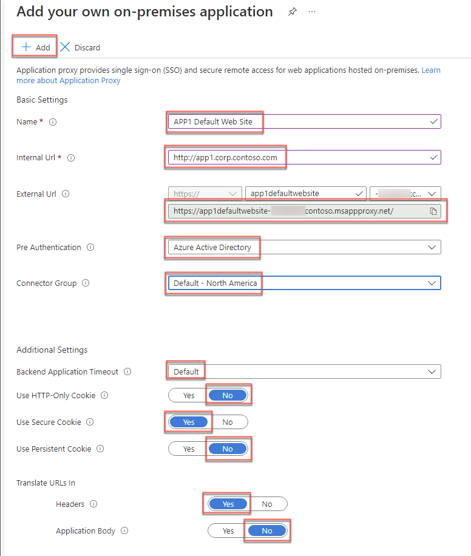

3. You will be automatically redirected to the **APP1 Default Web Site - Overview** blade.

4. On the **APP1 Default Web Site - Overview** blade, in the **Getting Started** section, select **Assign users and groups**.

    

5. On the **APP1 Default Web Site - Users and groups** blade, select **+ Add user**.

6. On the **Add Assignment** blade, specify the following settings and select **Assign**:

    - Users and groups: **Engineering**

    - Select Role: **User**

    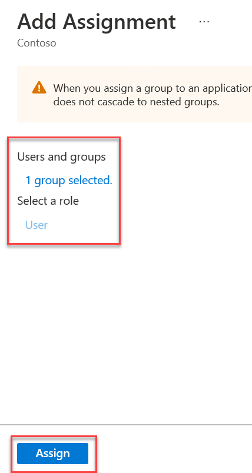

7. On the **APP1 Default Web Site - Users and groups** blade, select **Single sign-on** under **Manage** on the left.

8. On the **APP1 Default Web Site - Single sign-on** blade, select **Windows Integrated Authentication**.

9.  Within the Remote Desktop session to **DC1**, start a **Command Prompt** and, from the **Command Prompt**, run the following to identify Service Principal Names associated with the APP1 computer account.

    ```
    setspn -L APP1
    ```

10. Review the output, switch back to the Internet Explorer window displaying the Azure portal, and, on the **APP1 Default Web Site - Configure Integrated Windows Authentication (IWA)**, specify the following settings and select **Save**.

    - Internal Application SPN: **HTTP/APP1.contoso.local**

    - Delegated Login Identity: **User principal name**

    

   > **Note**: The HTTP service class is one of the built-in services that act as an alias to the HOST SPN. For more information, refer to **How to use SPNs when you configure Web applications that are hosted on Internet Information Services** at <https://support.microsoft.com/en-us/help/929650/how-to-use-spns-when-you-configure-web-applications-that-are-hosted-on>

12. Within the Remote Desktop session to **DC1**, in the Server Manager console, select **Tools** and then select **Active Directory Users and Computers**. 

13. In the **Active Directory Users and Computers** console, select **View** and, in the **View** menu, enable **Advanced Features**.

    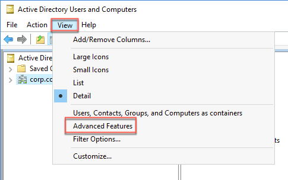

14. In the **Active Directory Users and Computers** console, locate the computer account hosting the Azure AD Application Proxy connector (**DC1** in our case) under **Domain Controllers** and display its **Properties** window.

    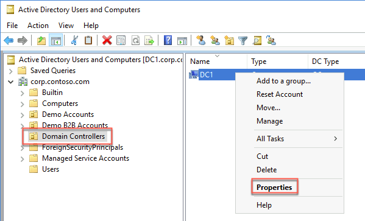

15. In the **DC1 Properties** window, switch to the **Delegation** tab and select the option **Trust this computer for delegation to specified services only**.

16. Select the option **Use any authentication protocol**, select **Add**, in the **Add Services** window, select **Users or Computers**, in the **Select Users or Computers** dialog box, in the **Enter the object names to select** text box, type **APP1** and select **OK**. 

    

17. Back in the **Add Services** window, select the **http** entry and select **OK**. 

    

18. Back in the **DC1 Properties** window, select **OK**.


### Task 3: Test an Azure AD Application Proxy application

1. From the lab computer, start a browser in Private mode and browse to <https://myapps.microsoft.com>. When prompted to sign in, use the **AGAyers\@<custom_domain_name>** user name with the **demo@pass123** password (where **<custom_domain_name>** placeholder represents the custom DNS domain name you assigned to the Contoso Azure AD tenant in the first exercise of this lab.

2. When prompted to enter a code, type the code which was texted to the mobile phone number that you provided in the previous exercise.

3. On the **Apps** page of the **Application Access Panel**, select the **APP1 Default Web Site** icon. This will automatically open a new browser tab displaying the Default Web Site page on APP1.


### Task 4: Create an Azure Active Directory tenant and activate an EMS E5 trial

In this task, you will create another Azure Active Directory tenant representing the Fabrikam organization, with the following settings: 

-   Organization name: **Fabrikam**

-   Initial domain name: any valid, unique domain name.

-   Country or region: **United States**

1. From the lab computer, start a new Web browser window and navigate to the Azure portal at <https://portal.azure.com>.

2. When prompted, sign into the Azure subscription into which you deployed resources in the Before Hands-On Lab exercises (the **Default Directory**).

3. On the lab computer, in the Azure portal, select **+ Create a resource**.

4. On the **New** blade, in the **Search the Marketplace** text box, type **Azure Active Directory** and, in the list of results, select **Azure Active Directory**.

5. On the **Azure Active Directory** blade, select **Create a tenant**.

6. On the **Create directory** blade, specify the following settings and select **Create**:

    -   Organization name: **Fabrikam**

    -   Initial domain name: any valid, unique domain name.

    -   Country or region: **United States**

    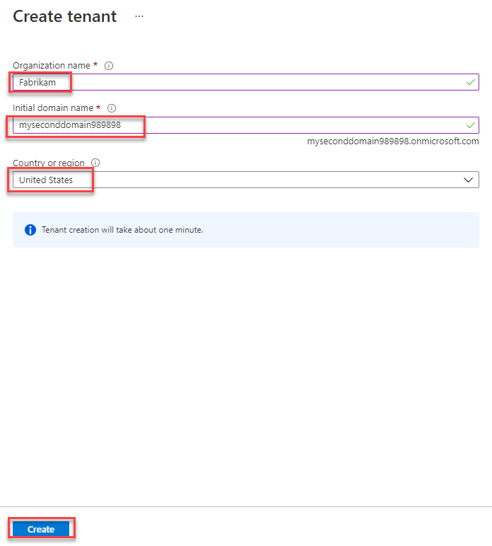

7. In the Azure portal, navigate to the blade of the newly created Azure Active Directory tenant. It may take a few minutes for the **Fabrikam** directory to show up under **Directory + Subscription**. 

8. On the **Fabrikam - Overview** blade, select **Licenses** on the left.

9.  On the **Licenses - Overview**, blade, select **All Products** under **Manage** on the left. Then select **+ Try/Buy**.

10. On the **Activate** blade, in the **ENTERPRISE MOBILITY + SECURITY E5** section, select **Free trial** and then select **Activate**.

    


### Task 5: Create and configure Azure AD users

In this task, you will configure Azure AD user accounts in the newly created Azure AD tenant with the following settings. This will include assigning EM+S E5 licenses to the user account you are using for this lab as well as creating a new Azure AD user account with the following settings and assigning to it the Global Administrator role as well as the EM+S E5 license.

- Name: **jane.doe**

- First name: **Jane**

- Last name: **Doe**
    
- Password: **Auto-generate password**
    
- Show Password: **Enabled**

- Groups: **0 group selected**
    
- Roles: **Global Administrator**
    
- Block sign in: **No**
    
- Usage location: **United States**
    
- Job title: leave blank
    
- Department: leave blank

1. From the lab computer, in the Azure portal, navigate back to the **Fabrikam - Overview** blade.

2. On the **Fabrikam - Overview** blade, select **Users**.

3. On the **Users - All users** blade, select the entry representing your user account.

4. On the **Profile** blade of your user account, in the **Settings** section, select the **edit** link.

    

5. In the **Settings** section, in the **Usage location** drop-down list, select the **United States** entry and select **Save**.

    

6. On the **Profile** blade of your user account, select **Licenses** under **Manage** on the left.

7. On the **Licenses** blade, select **+ Assignments**.

8. On the **Update license assignments** blade, enable the **Enterprise Mobility + Security E5** checkbox, ensure that all the corresponding license options are enabled, and select **Save**.

9.  On the **Users - All users** blade, select **+ New user**.

10. On the **New user** blade, ensure that the **Create user** option is selected, specify the following settings, and select **Create**:

    - User name: **jane.doe\@*your Azure AD tenant domain name*** where ***your Azure AD tenant domain name*** is the domain name you specified when creating the Fabrikam Azure AD tenant in the previous task.

    - Name: **jane.doe**

    - First name: **Jane**

    - Last name: **Doe**
    
    - Password: **Auto-generate password**
    
    - Show Password: **Enabled**

    - Groups: **0 group selected**
    
    - Roles: **Global Administrator**
    
    - Block sign in: **No**
    
    - Usage location: **United States**
    
    - Job title: leave blank
    
    - Department: leave blank

    > **Note**: Copy the **User name** and **Password** values into Notepad. You will need them later in this lab.

    

11. On the **Users - All users** blade, select the entry representing the newly created user account.

12. On the **jane.doe - Profile** blade, select **Licenses** under **Manage** on the left.

13. On the **jane.doe - Licenses** blade, select **+ Assignments**.

14. On the **Update license assignments** blade, enable the **Enterprise Mobility + Security E5** checkbox, ensure that all the corresponding license options are enabled, and select **Save**.


### Task 6: Create and configure Azure AD guest user and group accounts

In this task, you will create and configure Azure AD guest accounts in the Contoso Azure AD tenant representing users in the Fabrikam Azure AD tenant.

1. Switch to the Remote Desktop session to **DC1**, in the Internet Explorer window displaying the Azure portal at <https://portal.azure.com> into which you are signed in with the **john.doe** credentials, navigate to the **Contoso - Overview** blade of the Contoso Azure AD tenant.

2. On the **Contoso - Overview** blade, select **Users** under **Manage** on the left.

3. On the **Users - All users** blade, select **+ New guest user**.

4. On the **New user** blade, ensure that the **Invite user** option is selected, specify the following settings, and select **Invite**:

    -  Name: **fabrikam-jane.doe**

    -  Email address: jane.doe@mynewdomain98.onmicrosoft.com

    -  First name: **Jane**

    -  Last name: **Doe**

    -  Personal message: **Welcome to the Contoso Azure AD tenant**

    -  Groups: **0 groups selected**

    -  Roles: **User**

    -  Block sign in: **No**

    -  Usage location: **United States**

    -  Job title : **Not set**

    -  Department : **Not set**

    

5. In the Azure portal navigate back to the **Contoso - Overview** blade of the Contoso Azure AD tenant and select **Groups** under **Manage** on the left.

6. On the **Groups - All groups** blade, select **+ New group**. 

7. On the **New group** blade, specify the following settings, and select **Create**:

    -  Group type: **Security**

    -  Group name: **Fabrikam B2B users**

    -  Group description: **Fabrikam B2B users**

    -  Membership type: **Assigned**

    -  Owners: **No owners selected**

    -  Members: **fabrikam-jane.doe**

    

8. On the **Groups - All groups** blade, select the newly created group and, on the **Fabrikam B2B users** group, copy its **Object id** value and paste it into Notepad. You will need it later in this exercise.

9.  Switch to the lab computer, start a web browser using in private/incognito mode and browse to the Azure portal.

10. When prompted, sign in by using the credentials of the **jane.doe** Fabrikam Azure AD user account.

11. When prompted, grant the Contoso Azure AD tenant requested permissions by selecting **Accept**. 

12. When prompted, change the password for the **jane.doe** Fabrikam Azure AD user account. 
  
    > **Note**: If you receive the message **We've seen that password too many times before. Choose something harder to guess**, you'll need to modify the password until it is unique enough to be accepted.

13. In the Azure portal, sign out from the Contoso Azure AD tenant and close the window of the web browser using in private/incognito mode.


### Task 7: Configure an Azure AD Application Proxy application for B2B access

In this task, you will configure an Azure AD Application Proxy application for B2B access.

1. Within the Remote Desktop session to **DC1**, in the Internet Explorer window displaying the Azure portal, navigate to the **Contoso - Overview** blade of the Contoso Azure AD tenant.

2. On the **Contoso - Overview** blade of the Contoso Azure AD tenant, select **Enterprise applications** under **Manage** on the left.

3. On the **Enterprise applications - All applications** blade, select **APP1 Default Web Site**.

4. On the **APP1 Default Web Site - Overview** blade, select **Users and groups** under **Manage** on the left.

5. On the **APP1 Default Web Site - Users and groups** blade, select **+ Add user**.

6. On the **Add Assignment** blade, specify the following settings and select **Assign**:

    - Users and groups: **fabrikam-jane.doe**

    - Select Role: **User**

7. Within the Remote Desktop session to **DC1**, in the Azure portal, navigate back to the **Contoso - Overview** blade of the Contoso Azure AD tenant.

8. On the **Contoso - Overview** blade, select **App registrations** under **Manage** on the left.

9.  On the **Contoso - App registrations** blade, select **+ New registration**.

10. On the **Register an application** blade, specify the following information and select **Register**:

    - Name: **Sync B2B users**

    - Supported account types: **Accounts in this organizational directory only (Contoso only - Single tenant)**

    - Redirect URI (Optional): **Web** and **https://loopback**

    

11. You will be automatically redirected to the **Sync B2B users** blade.

12. On the **Sync B2B users** blade, select **API permissions** under **Manage** on the left. 

13. On the **Sync B2B users - API permissions** blade, in the **Configured permissions** section, select **+ Add a permission**.

14. On the **Request API permission** blade, switch to the **APIs my organization uses** tab, in the search text box, type **Windows Azure Active Directory**, in the list of results, select **Windows Azure Active Directory**, and then select **Application permissions**.

    

15. On the **Request API permission** blade, in the **Select permissions** section, expand the **Directory** subsection, enable the **Directory.Read.All** checkbox, and select **Add permission**.

    

16. Back on the **Sync B2B users - API permissions** blade, in the **Configured permissions** section, select **Grant admin consent for Contoso**. Select **Yes** when prompted.

17. If prompted, sign in with the credentials of the **john.doe** Contoso Azure AD user account and, on the **Permissions requested Accept for your organization** page, select **Accept**.

18. Review the status of the permissions listed in the **Configured permissions** section on the **Sync B2B users - API permissions** blade and ensure that they it is listed as **Granted for Contoso**.

    

19. On the **Sync B2B users - API permission** blade, select **Certificates & secrets** under **Manage** on the left.

20. On the **Sync B2B users - Certificates & secrets** blade, select **+ New client secret**.

21. On the **Add a client secret** blade, specify the following information and select **Add**.

    - Description: **Sync B2B users secret 1**

    - Expires: **In 1 year**

22. Copy the resulting secret value. You will need it later in this task.

    > **Note**: This value will not be displayed again and cannot be retrieved once you navigate away from the current page. If you lose it, you will have to delete the secret and create another one.

23. On the **Sync B2B users** blade, select **Overview** on the left.

24. On the **Sync B2B users - Overview** blade, note the values of the **Application (client) ID** and **Directory (tenant) ID**. You will need them later in this task.

25. Within the Remote Desktop session to **DC1**, switch to the **Active Directory Users and Computers** console. 

26. In the **Active Directory Users and Computers** console, expand the **contoso.local** node, create an organizational unit named **Demo B2B Accounts** directly in the root of the domain with two child organizational units named **Enabled** and **Disabled**.

    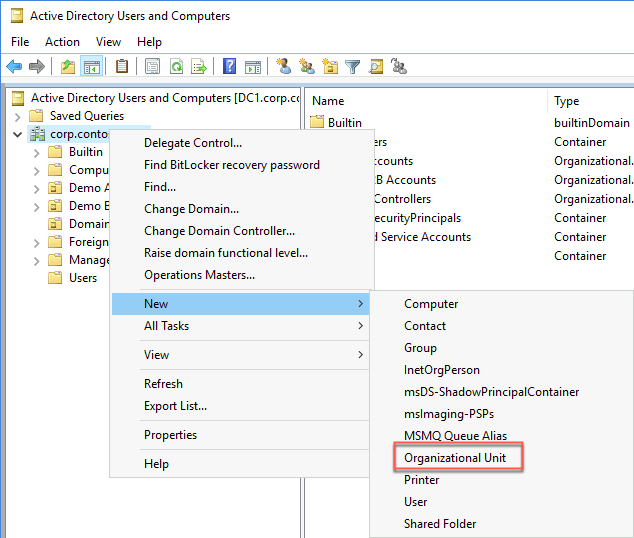

    > **Note**: These OUs must NOT be synchronized back to the Azure AD tenant using Azure AD Connect. Make sure not to include the guest user objects in the synchronization scope.

27. Within the Remote Desktop session to **DC1**, switch to the Windows PowerShell ISE window and, from the console pane, run the following to add a suffix matching the default DNS name of the Contoso Azure AD tenant (replace the `<domain_name>` placeholder with the name of the default domain name associated with the Contoso Azure AD tenant):

    ```pwsh
    Get-ADForest | Set-ADForest -UPNSuffixes @{Add="<domain_name>.onmicrosoft.com"}
    ```

28. Within the Remote Desktop session to **DC1**, start Internet Explorer and browse to <https://www.microsoft.com/en-us/download/details.aspx?id=51495>.

29. From the **Connectors for Microsoft Identity Manager 2016 SP1 and Forefront Identity Manager 2010 R2 SP1** page, download **1.1.953.0\Script and Readme to pull Azure AD B2B users on-prem_v1.0.3.zip** and extract its content.

30. Within the Remote Desktop session to **DC1**, in the Windows PowerShell ISE window, open the newly extracted PowerShell script **AppProxy-GuestAccountCreation-v1.0.3.ps1** and modify its content by replacing the `TODO` placeholders following the instructions provided in the script:

    ```pwsh
    $B2BGroupSid = "TODO" #Fabrikam B2B users Azure AD group's ObjectID that you identified earlier in this exercise.
    $ShadowAccountOU = "OU=Enabled,OU=Demo B2B Accounts,DC=contoso,DC=local" #Organizational Unit for placing shadow accounts
    $ShadowAccountOUArchive = "OU=Disabled,OU=Demo B2B Accounts,DC=contoso,DC=local" #Organizational Unit for moving disabled shadows

    # Requires Azure AD configuration - refer to documentation
    $appID = "TODO" #The value of Client ID parameter of the Sync B2B user application you identified earlier in this exercise
    $appSecret = "TODO" #The value of the secret of the Sync B2B user application you identified earlier in this exercise
    $tenantdomain   = "TODO" #<domain_name>.onmicrosoft.com, where `<domain_name>` designates the name of the default domain name associated with the Contoso Azure AD tenant
    $tenantID = "TODO" #The value of Azure AD tenant ID parameter of the Sync B2B user application you identified earlier in this exercise
    ```
    > **Note**: For more information regarding the script and its implementation, refer to the **Readme - Script to pull Azure AD B2B users on-prem_v1.0.3.pdf** file, included in the **1.1.953.0\Script and Readme to pull Azure AD B2B users on-prem_v1.0.3.zip** file you downloaded earlier in this task.

31. Execute the script and ensure that it did not return any error messages. 

    > **Note**: You can schedule script execution in regular intervals by using Windows Scheduled Tasks. For details, refer to the **Readme - Script to pull Azure AD B2B users on-prem_v1.0.3.pdf** file

32. Switch back to the Azure Active Directory Users and Computers console and verify that a user account of **jane.doe** is listed in the **Demo B2B Accounts\\Enabled** organizational unit. You may have to refresh the console. 

    > **Note**: In a production environment, you could provide access to Integrated Windows Authentication apps by leveraging Microsoft Identity Manager. You can also provide access to on-premises apps that support SAML-based authentication directly from the Azure portal. For more information, refer to Grant B2B users in Azure AD access to your on-premises applications at <https://docs.microsoft.com/en-us/azure/active-directory/b2b/hybrid-cloud-to-on-premises>.

    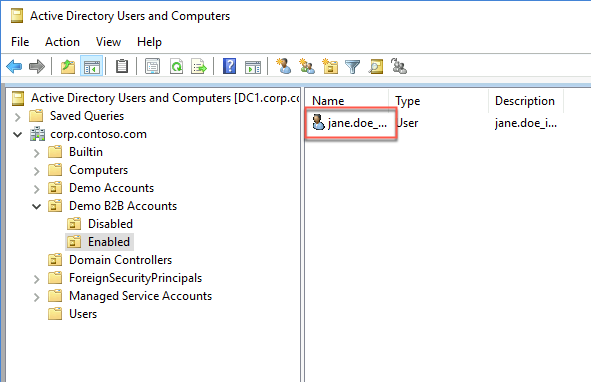


### Task 8: Test an Azure AD Application Proxy application

1. From the lab computer, start a browser in Private mode and browse to <https://myapps.microsoft.com>.

2. When prompted, sign in by using the **jane.doe** Fabrikam Azure AD user account. 

3. Once signed in, select the **Jane Fabrikam** icon in the upper right corner of the Application Access Panel page and, in the drop-down menu, select **Contoso**.

4. On the **Apps** page of the **Application Access Panel**, select the **APP1 Default Web Site** icon. This will automatically open a new browser tab displaying the Default Web Site page on APP1.


### Summary

In this exercise, you configured access to on-premises Integrated Windows Authentication app (implemented as the default IIS web site) from the internet by installing and configuring Azure AD Application Proxy. You also tested access to this application by using a Contoso Azure AD tenant user account as well as by using a Fabrikam Azure AD tenant user account configured as a guest account in the Contoso Azure AD tenant. 

## Lab summary

In this hands-on lab, you setup and configured a number of different hybrid identity scenarios. The scenarios involved an Active Directory single-domain forest named contoso.local, which in this lab environment, consisted (for simplicity reasons) of a single domain controller named DC1 and a single domain member server named APP1. You explored Azure AD-related capabilities that allowed you to integrate Active Directory with Azure Active Directory, optimized hybrid authentication and authorization, and provided secure access to on-premises resources from Internet for both organizational users and users who are members of partner organizations. 

## After the hands-on lab

Duration: 20 Minutes

### Task 1: Delete resources

1. Now that the HOL is complete, go ahead and delete all of the Resource Groups created for this HOL. You will no longer need those resources, and it will be beneficial to clean up your Azure Subscription. In addition, remove the verified domain from the Contoso Azure AD tenant.

You should follow all steps provided *after* attending the Hands-on lab.

